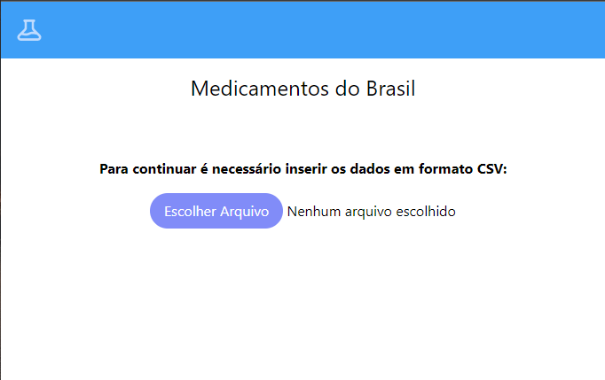

# Medicamentos do Brasil - Front End



Front End do projeto desenvolvido para a 
Etapa 2 do Programa IT Academy – Processo Seletivo – Edição #16


## 💻 Pré-requisitos

Antes de começar, verifique se você atendeu aos seguintes requisitos:

* Você instalou a versão mais recente de `Node.js` e do `yarn`
* Você leu o guia do funcionamento do software disponível em <a href="../Etapa 2.pdf">Etapa 2</a>
* A sua porta `3000` está livre


## 🚀 Instalando o Medicamentos do Brasil

Para instalar o projeto, insira esse comando no terminal
```
yarn install
```

## ☕ Usando o projeto

Para usá-lo rode o comando

Com npm:

```
npm run start
```

Com yarn:

```
yarn start
```